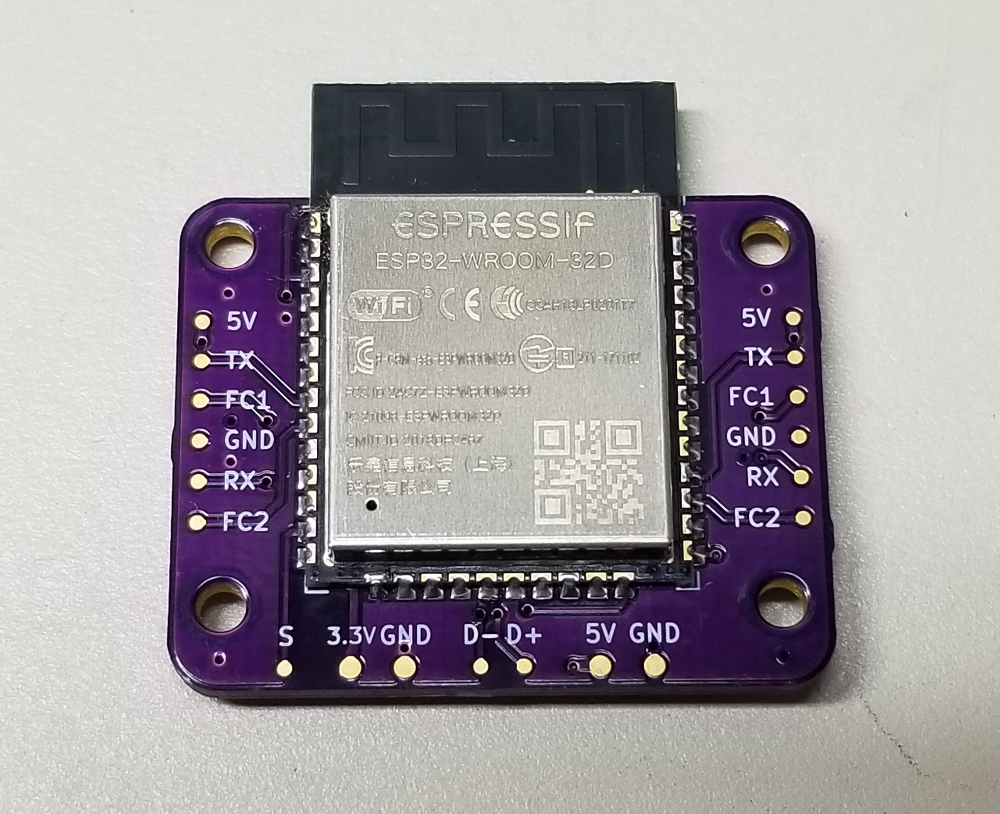

# Wii-Bluetooth-Replacement

  

This project is a full replacement for the Nintendo Wii's Bluetooth module. Emulation of the Bluetooth module is performed on the PIC32 based on [rnconrad's emulator](https://github.com/rnconrad/WiiBluetoothEmulator), while controller connectivity on the ESP32 is based on [btstack](https://github.com/bluekitchen/btstack).

The device interfaces with various wireless controllers and emulates up to 4 virtual Wii Remotes to communicate with the Wii. Virtual Wii Remotes can be configured to have a Nunchuk, Classic Controller, or neither. Currently supported controllers are Wii Remote, Wii U Pro Controller, Joy-Con, and Switch Pro Controller. Joy-Con can also be used through wired functionality.

The PCB for this design can be purchased [here](https://oshpark.com/shared_projects/co8uBM0Z).

## Supported Features

- Permanent syncing: Press the sync button on the ESP32 along with the sync button on any controllers you want to pair. The ESP32 will pair and store each controller's information so reconnection works smoothly. Joy-Con can also be paired by docking them to the ESP32.

- Extension switching: Controllers that don't support physical extension controllers (Nunchuk and Classic Controller) can cycle through virtual extensions. Long-press Home to cycle through each one. Switch and Wii U Pro Controllers support sideways Wii Remote, Nunchuk, and Classic Controller. Dual Joy-Con support Nunchuk and Classic Controller. Single Joy-Con (R) supports only vertical Wii Remote and Joy-Con (L) supports only Nunchuk.

- IR pointer emulation: The Wii Remote IR pointer is emulated by gyro control (for Joy-Con, Switch Pro, and Wii Remote Plus) or by the right joystick for any controllers that have it. The cursor can be re-centered by pressing R (long-press Plus on Wii Remote). Gyro can be re-calibrated by long-pressing R (long-press Home on Wii Remote) and letting the controller be still for a few seconds.

## Planned Features

- New platform: A hardware revision is planned based on the PIC32MX470F512 and the TI CC2564 BT module. This will hopefully resolve some current hardware issues and improve data throughput with more processing speed.

- DPad to joystick mapping: The Wii Remote DPad will eventually be mapped to the left joystick whenever a controller has no virtual extension attached.

- More single Joy-Con functionality: Each single Joy-Con (L or R) will eventually be usable as its own Wii Remote. Single Joy-Con mode will be enabled by holding SL + SR for a few seconds after the Joy-Con is connected. Each will function as a sideways Wii Remote with a gyro pointer which can be toggled by pressing the joystick.

- More wired Joy-Con functionality: Wired Joy-Con are not well tested and implementation is unfinished. They currently do not support virtual extensions or rumble. 

- Wii Motion Plus: Motion Plus emulation is mostly implemented but not tested. It should be functional on any controller with a gyroscope.

## Known Issues

This project is experimental and has plenty of bugs. Below is a list of some important issues that still need fixing.

- Wii Remote connectivity: Currently only newer Wii Remotes (TR versions) can auto-connect to the ESP32 by pressing any button on the controller. Older Wii Remotes must be synced every time. This is due to a hardware incompatibility with the ESP32 and will require moving away from the ESP32 platform.

- Joy-Con connectivity: Joy-Con are finnicky and sometimes won't auto-connect. Fixing this will also require moving away from the ESP32 platform (but this issue seems to exist on some other platforms too). Resetting the Joy-Con by pressing the black button on the side seems to help.

- Reconnecting a controller: The PIC32 currently doesn't handle reconnections very well and may become unusable in-game if you disconnect a controller and try to reconnect it. Power cycling may be necessary (pressing the reset button on the Wii doesn't reinitialize the Bluetooth module).

- Multiplayer use: Connecting more players beyond player 1 may not work well or at all depending on the software. Using two Joy-Con for the same player works fine.

- HD rumble: Joy-Con and Switch Pro Controllers do support rumble and it usually works fine, but sometimes it will stop working until the controller is reconnected. Needs to be looked into.
